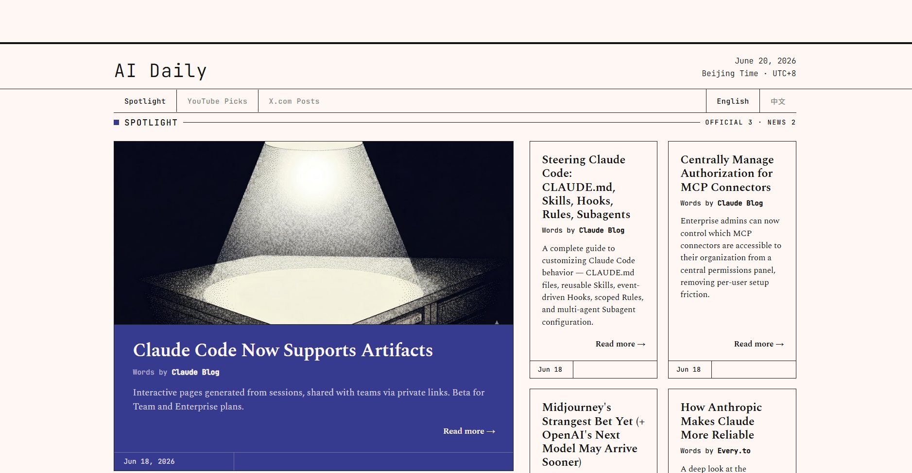
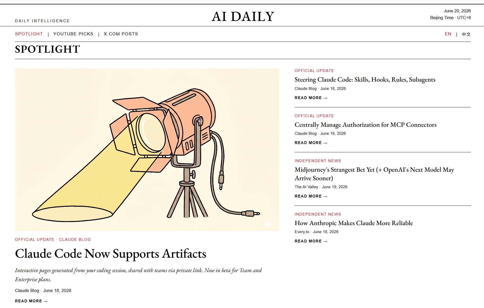

# AI Daily

A Claude Code skill that fetches today's AI news from multiple sources and generates a bilingual (English + Chinese) HTML newspaper — in two design styles.

Built as a [Claude Code skill](https://docs.anthropic.com/en/docs/claude-code/skills) so it runs directly inside your AI assistant workflow.

---

## What it does

Every day, run one command in Claude Code:

> "today's daily brief" / "今天的 AI 日报"

Claude will:
1. Fetch today's AI news from Anthropic, OpenAI, Claude Blog, The AI Valley, smol.ai, Every.to newsletters
2. Pull the latest videos from 10 AI YouTube channels
3. Scrape top posts from 18 AI accounts on X.com (filtered for AI relevance)
4. Save a bilingual Markdown digest
5. Ask if you want an HTML newspaper — in **Rationalist** or **Modernism** style (or both)

---

## Design styles

### Rationalist
Inspired by [Works in Progress](https://worksinprogress.co/) — academic editorial feel, serif + monospace fonts, warm off-white background, sticky hero image, bilingual toggle.



### Modernism
Inspired by [Monocle](https://monocle.com/) — minimal black and white, large EB Garamond masthead that shrinks on scroll, 4-column YouTube card grid, 2-column X.com feed, bilingual toggle.



---

## Requirements

- [Claude Code](https://docs.anthropic.com/en/docs/claude-code) (the CLI)
- Python 3.9+
- [twscrape](https://github.com/vladkens/twscrape) for X.com scraping:
  ```bash
  pip install "twscrape[curl]"
  ```
- An X.com account with valid session cookies (`auth_token` + `ct0`)

---

## Setup

**Option 1 — Plugin marketplace (recommended)**

```
/plugin marketplace add jazzleg66/AI-Daily
/plugin install ai-daily@ai-daily
```

Claude Code downloads and registers the skill automatically. Generated files go to `~/.claude/ai-daily/output/` on first run.

**Option 2 — Manual copy**

```bash
# macOS / Linux
git clone https://github.com/jazzleg66/AI-Daily.git
cp -r AI-Daily/skills/ai-daily ~/.claude/skills/ai-daily

# Windows
git clone https://github.com/jazzleg66/AI-Daily.git
xcopy /E /I "AI-Daily\skills\ai-daily" "%USERPROFILE%\.claude\skills\ai-daily"
```

**Option 3 — Other AI coding agents**

Clone the repo and point your agent at `skills/ai-daily/SKILL.md` as context. Set `<BASE>` to the `skills/ai-daily/` directory path.

**2. Configure X.com credentials**

Create the credentials file:

```bash
# macOS / Linux
mkdir -p ~/.claude/private

# Windows
mkdir "%USERPROFILE%\.claude\private"
```

```json
// ~/.claude/private/x-creds.json
{
  "auth_token": "your_auth_token_here",
  "ct0": "your_ct0_here"
}
```

To get your cookies: log into x.com in a browser, open DevTools → Application → Cookies → copy `auth_token` and `ct0`.

---

## Usage

After installing, invoke the skill in Claude Code with the slash command:

```
/ai-daily:ai-daily
```

Or just say it in plain language:

```
today's daily brief
```

```
今天的 AI 日报
```

Claude will run the fetch scripts, show you a summary, save a Markdown file, and ask if you want the HTML newspaper.

### Use with other AI coding agents

This skill can also be used with other AI coding agents (Cursor, Windsurf, etc.) by referencing the SKILL.md directly from the repo:

```
skills/ai-daily/SKILL.md
```

Point your agent at that file as a system prompt or context document. Scripts and assets are referenced via `<BASE>` — set that to the `skills/ai-daily/` directory.

### Customise your sources

- **News:** Edit `fetch_news.py` to add or remove sites
- **YouTube channels:** Edit `CHANNELS` in `fetch_youtube.py`
- **X.com accounts:** Edit `X_ACCOUNTS` in `fetch_x.py`
- **AI keyword filter:** Edit `AI_KEYWORDS` in `fetch_x.py` to tune what counts as AI-relevant

---

## File structure

```
AI-Daily/
├── .claude-plugin/
│   ├── marketplace.json              # Plugin marketplace catalog
│   └── plugin.json                   # Plugin manifest
├── .gitignore
├── README.md
├── resources.md                      # Source list
├── skills/
│   └── ai-daily/
│       ├── SKILL.md                  # Skill definition — Claude reads this
│       ├── scripts/
│       │   ├── fetch_news.py         # Fetches Anthropic, OpenAI, blogs, newsletters
│       │   ├── fetch_youtube.py      # Fetches AI YouTube channels via RSS
│       │   └── fetch_x.py            # Fetches X.com posts via twscrape
│       ├── assets/
│       │   ├── rationalist/
│       │   │   ├── template.html     # Rationalist HTML template
│       │   │   ├── spotlight.jpg     # Hero image (Spotlight section)
│       │   │   └── youtubepicks.jpg  # Hero image (YouTube section)
│       │   └── modernism/
│       │       ├── template.html     # Modernism HTML template
│       │       ├── spotlight.png     # Hero image (Spotlight section)
│       │       └── youtubepicks.png  # Hero image (YouTube section)
│       └── output/                   # Seed images only (tracked); generated files go to ~/.claude/ai-daily/output/
│           ├── spotlight.jpg
│           ├── youtubepicks.jpg
│           ├── spotlight.png
│           └── youtubepicks.png
└── screenshots/
    ├── rationalist-preview.jpeg
    └── modernism-preview.jpeg
```

Generated files (`daily-brief-*.md`, `r-brief-*.html`, `m-brief-*.html`) are saved to `~/.claude/ai-daily/output/` — outside the plugin, so they persist across updates and are easy to find.

---

## Troubleshooting

**`git clone` fails with "Connection was reset" (China users)**

Your browser can reach GitHub but `git` doesn't route through your VPN/proxy by default. Fix:

```bash
git config --global http.proxy http://127.0.0.1:7890
git config --global https.proxy http://127.0.0.1:7890
```

Replace `7890` with your proxy's actual port (Clash default: 7890, V2Ray: 1080 or 10809). Then retry `git clone`.

To unset later: `git config --global --unset http.proxy && git config --global --unset https.proxy`

---

## Design credits

- **Modernism style** — layout and typography inspired by [Monocle](https://monocle.com/)
- **Rationalist style** — layout and typography inspired by [Works in Progress](https://worksinprogress.co/)

---

## License

MIT
